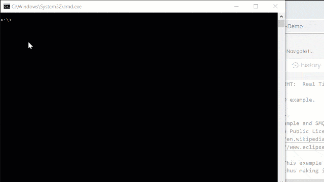

# Java and Android SMQ Client Library and Example

This directory contains the SMQ Java client library and example code for
standard Java and Android.

The Java SMQ client operates over secure TLS connections. TLS is managed by the
Java platform.

## Java Swing Example

The included Java Swing example connects to a public test broker and lets you
control LEDs from a desktop UI. The same broker can also be used by browser,
C, and embedded examples, making it useful for testing real-time synchronization
between multiple clients.



Compile and run the Swing example from this directory:

``` shell
javac LedSMQ.java
java LedSMQ
```

The Swing example connects to the
[public SMQ test broker](https://simplemq.com/m2m-led/). You can control any
connected devices or run a simulated device with the
[online device C example](https://repl.it/@RTL/SMQ-LED-Demo). The example also
opens a browser window for the LED example's HTML5 UI, so you can see the
Swing and browser clients synchronize in real time.

See the
[SMQ LED example tutorial](https://makoserver.net/articles/Browser-to-Device-LED-Control-using-SimpleMQ)
for more information.

## Using the Library

The SMQ Java library is in [RTL/SMQ](RTL/SMQ/). Depending on the target
environment, include only the relevant platform adapter:

- Standard Java/Swing builds should exclude `RTL/SMQ/AndroidSMQ.java`.
- Android builds should exclude `RTL/SMQ/SwingSMQ.java`.

The library does not depend on the example UI packages listed below.

## Android

Include the SMQ Java code in your Android build, excluding
`RTL/SMQ/SwingSMQ.java`.

A ready-to-use Android example can be downloaded from the
[SMQ source code page](https://realtimelogic.com/products/simplemq/src/). A
precompiled example is available on
[Google Play](https://play.google.com/store/apps/details?id=demo.smq_android).

## Example Source

- [LedSMQ.java](LedSMQ.java): Swing LED example.
- [org/json](org/json/): JSON library used by `LedSMQ.java`.
- [eu/hansolo/steelseries](eu/hansolo/steelseries/): LED UI widgets used by
  `LedSMQ.java`.
